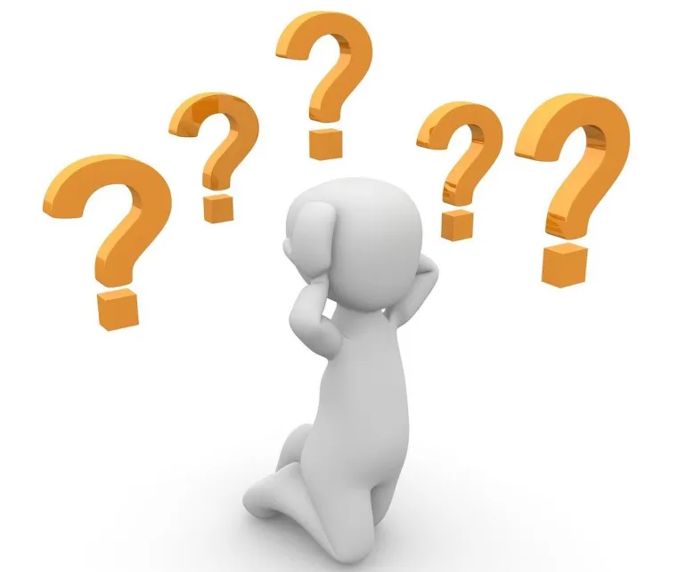
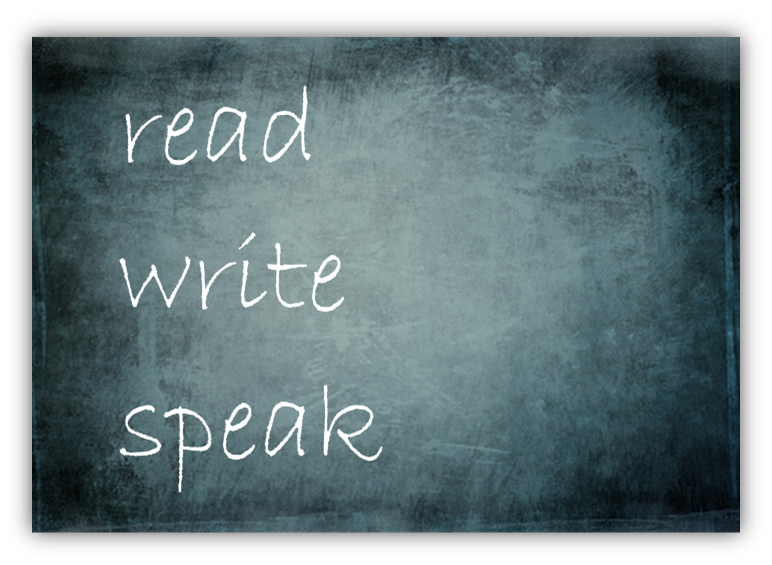
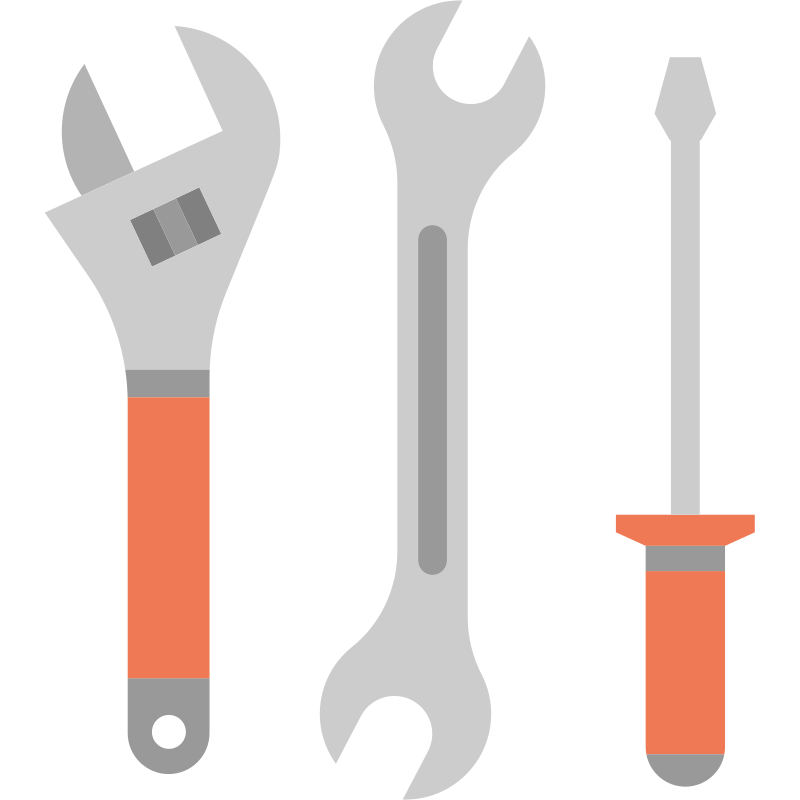
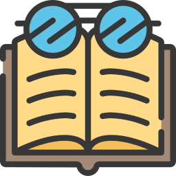
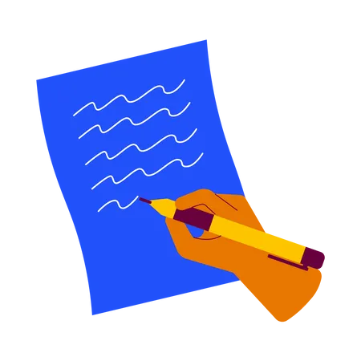
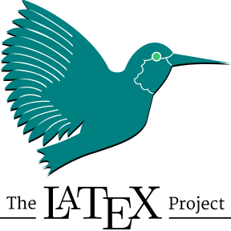
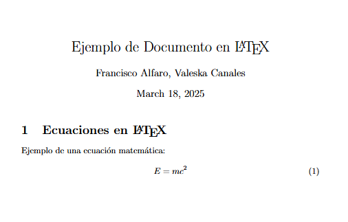
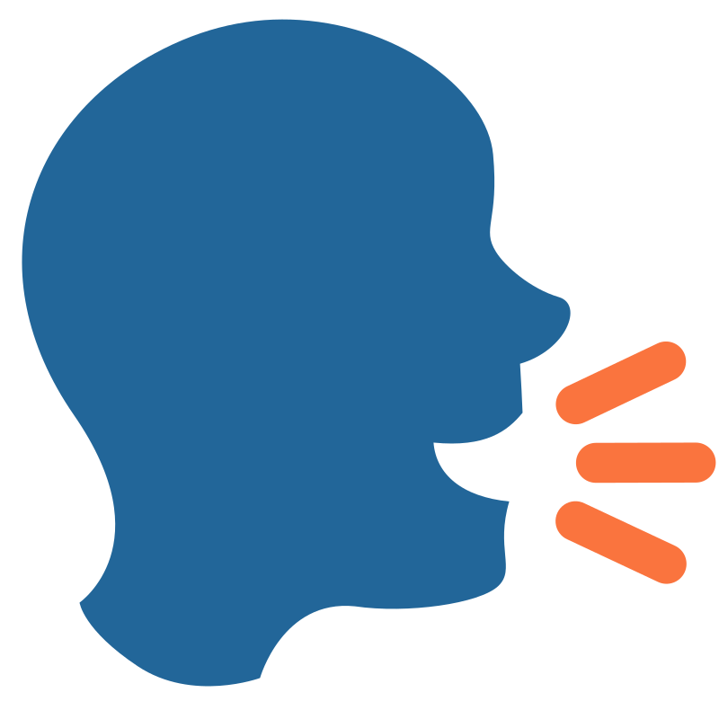
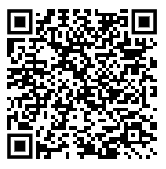

## 🎓 Retos Universitarios {background-image="images/background.jpg" background-opacity="0.25"}

::: r-stack
<br>

{.fragment .fade-in-then-out fig-align="left"}

{.fragment .fade-in-then-out fig-align="center"}

{.fragment fig-align="right"}
:::

------------------------------------------------------------------------

## 🎯 Objetivos {background-image="images/background.jpg" background-opacity="0.25"}

::: columns
::: {.column width="40%"}
::: {style="text-align: center;"}

:::
:::

::: {.column .incremental width="60%"}
<br>

-   Enfrentando los desafíos académicos: leer, escribir y hablar.
-   Importancia de dominar estas habilidades en la universidad.
-   Estrategias clave para mejorar la comprensión y expresión académica.
:::
:::

------------------------------------------------------------------------

##  {background-image="images/background_slides3.png" background-opacity="0.3"}

::: {style="display: flex; justify-content: center; align-items: center; height: 60vh; flex-direction: column; text-align: center;"}
[Sesión 03]{style="font-size: 1em"}

[**Paso 1: Leer con propósito**]{style="font-size: 1.5em"}
:::

------------------------------------------------------------------------

## 📚 Lectura Académica

::: columns
::: {.column width="40%"}
::: {style="text-align: center;"}

:::
:::

::: {.column .incremental width="60%"}
<br>

-   Los textos académicos son complejos y están escritos para especialistas.
-   Artículos y capítulos teóricos son comunes en la universidad.
-   Herramientas clave: preparar, abordar y resumir la lectura.
:::
:::

## ✍️ Puntos Claves

::: columns
::: {.column width="40%"}
::: {style="text-align: center;"}
<br> 
:::
:::

::: {.column .incremental width="60%"}
<br>

- **Propósito**:  
  - ¿Para qué lees? (entender, resumir, debatir).

- **Estructura**:  
  - Resumen breve, citas y referencias.

- **Consejos**:  
  - Explica con tus palabras.  
  - Apoya con esquemas o mapas.  
  - Usa colores o íconos.
:::
:::


------------------------------------------------------------------------

## ✨ Cómo Subrayar un Texto

::: columns
::: {.column width="40%"}
::: {style="text-align: center;"}
<br> 
:::
:::

::: {.column .incremental width="60%"}
<br>

- **Estrategias**:  
  - Define el propósito antes de destacar.  
  - Lee primero de forma panorámica.  
  - Destaca solo el 20% del texto con colores útiles.  
- **Reglas**:  
  - **Omitir** lo irrelevante.  
  - **Seleccionar** lo esencial.  
  - **Generalizar** ideas comunes.  
  - **Integrar** conceptos conectados. 
:::
:::

------------------------------------------------------------------------

## 🧠 Enfrentar una Lectura

::: columns
::: {.column width="40%"}
::: {style="text-align: center;"}
<br> 
:::
:::

::: {.column .incremental width="60%"}
<br>

- **Tiempo**:  
  - Lee por bloques de 25-30 min (Pomodoro).  
  - Pausas cortas para mantener foco.

- **Mentalidad**:  
  - No todo se entiende altiro.  
  - Hazte preguntas mientras lees.

- **Apoyos**:  
  - Espacio tranquilo y sin distracciones.  
  - Respira y vuelve si te bloqueas.
:::
:::


------------------------------------------------------------------------

## 📚 Ejemplo Práctico

::: columns
::: {.column width="40%"}
::: {style="text-align: center;"}

:::
:::

::: {.column width="60%"}
<br><br><br>

-   🔗 **Explora el siguiente ejemplo aquí:**
    -   👉 [📂 Acceder al ejemplo](https://drive.google.com/drive/folders/1gXyHib1KCgt5k1gPpvfLAW2A4TI4OV0v?usp=drive_link)\
:::
:::

------------------------------------------------------------------------

##  {background-image="images/background_slides3.png" background-opacity="0.3"}

::: {style="display: flex; justify-content: center; align-items: center; height: 60vh; flex-direction: column; text-align: center;"}
[Sesión 03]{style="font-size: 1em"}

[**Paso 2: Escribir con claridad**]{style="font-size: 1.5em"}

:::

------------------------------------------------------------------------


## ✍️ Escritura Académica

::: columns
::: {.column width="40%"}
::: {style="text-align: center;"}

:::
:::

::: {.column .incremental width="60%"}
<br>

- Estilo **formal, claro y ordenado**.  
- Presente en **informes, artículos, tesis**.  
- Basada en **evidencia, fuentes y citas**.  
- Fomenta el **pensamiento crítico** y la difusión del conocimiento.

:::
:::

---

## 🧩 Etapas de la Escritura

::: columns
::: {.column width="40%"}
::: {style="text-align: center;"}

:::
:::

::: {.column .incremental width="60%"}
<br>

- **Preparar**:  
  - Lluvia de ideas, esquemas y planificación.

- **Redactar**:  
  - Escribe borradores, integra fuentes y organiza ideas.

- **Revisar**:  
  - Mejora el texto en varias rondas: claridad, coherencia y estilo.

:::
:::

---

## 🎯 Delimita tu Tema

::: columns
::: {.column width="40%"}
::: {style="text-align: center;"}

:::
:::

::: {.column .incremental width="60%"}
<br>

- **Infórmate**: 
  - Conoce el contexto y antecedentes.  
- **Enfoca**:
  -  Define el objetivo y las preguntas clave.  
- **Acota**: 
  - Determina el alcance (tiempo, lugar, población).  
- **Evalúa**:
  -  Que sea viable y relevante para investigar.

:::
:::

---


## 🧱 Estructura de un Artículo

::: columns
::: {.column width="40%"}
::: {style="text-align: center;"}

:::
:::

::: {.column .incremental width="60%"}


<br>

- **Inicio**  
  *¿De qué trata?*  
  → Resumen, Introducción, Marco teórico  

- **Desarrollo**  
  *¿Cómo se investigó y qué se encontró?*  
  → Metodología, Resultados, Discusión  

- **Cierre**  
  *¿Qué significa y qué sigue?*  
  → Conclusión y Referencias

:::
:::


------------------------------------------------------------------------

## 📝 Documentos Académicos con LaTeX

::: columns
::: {.column width="40%"}
::: {style="text-align: center;"}

:::
:::

::: {.column .incremental width="60%"}
<br>

- **¿Qué es LaTeX?**  
  - Sistema para crear documentos académicos y científicos con formato profesional.  

- **¿Por qué usarlo?**  
  - Automatiza referencias y ecuaciones.  
  - Ofrece mayor control sobre formato y estructura.
:::
:::

------------------------------------------------------------------------

## 📝 Ejemplo de código en LaTeX

::: panel-tabset
## Código

```latex
\documentclass{article}
\usepackage{amsmath}

\begin{document}
\title{Ejemplo de Documento en \LaTeX}
\author{Francisco Alfaro, Valeska Canales}
\date{\today}
\maketitle

\section{Ecuaciones en \LaTeX}
Ejemplo de una ecuación matemática:

\begin{equation}
E = mc^2
\end{equation}

\end{document}
```

## Salida

::: {style="text-align: center;"}

:::

:::

------------------------------------------------------------------------


## 📝 Overleaf: LaTeX Online  

::: columns  
::: {.column width="40%"}  
::: {style="text-align: center;"}  
  
:::  
:::  

::: {.column .incremental width="60%"}  
<br>  

- **¿Qué es?**  
  - Plataforma en línea para escribir y compilar documentos en LaTeX sin instalación.  

- **¿Por qué usarlo?**  
  - Edición colaborativa en tiempo real.  
  - Integración con GitHub y la nube.  
  - Compilación y previsualización instantánea.  
:::  
:::

------------------------------------------------------------------------

## 📝 Recursos en línea para LaTeX

<br>

- 📖 [**Aprende LaTeX en minutos**](https://github.com/luong-komorebi/Begin-Latex-in-minutes/blob/master/Translation-Spanish.md): Guía rápida en español.  
- 🖊️ [**Overleaf**](https://www.overleaf.com/): Editor LaTeX colaborativo online.  
- 📊 [**Tables Generator**](https://www.tablesgenerator.com/): Crea tablas en LaTeX fácilmente.  
- 🔢 [**LaTeX Equation**](https://latexeditor.lagrida.com/): Generador de ecuaciones LaTeX.  
- 🧾 [**BibTeX Editor**](https://truben.no/latex/bibtex/): Editor de bibliografía en línea.

------------------------------------------------------------------------

## 📚 Ejemplo Práctico

::: columns
::: {.column width="40%"}
::: {style="text-align: center;"}

:::
:::

::: {.column width="60%"}
<br><br><br>

-   🔗 **Explora el siguiente ejemplo aquí:**
    -   👉 [📂 Acceder al ejemplo](https://drive.google.com/drive/folders/1zCksGCfUIveoCEGNYKYwWuT7Plzlc2Zg?usp=drive_link)\
:::
:::

------------------------------------------------------------------------

##  {background-image="images/background_slides3.png" background-opacity="0.3"}

::: {style="display: flex; justify-content: center; align-items: center; height: 60vh; flex-direction: column; text-align: center;"}
[Sesión 03]{style="font-size: 1em"}

[**Paso 3: Hablar con seguridad**]{style="font-size: 1.5em"}


:::

------------------------------------------------------------------------

## 🗣️ Enfrentando Presentaciones Orales

::: columns
::: {.column width="40%"}
::: {style="text-align: center;"}

:::
:::

::: {.column .incremental width="60%"}
<br>

-   **Preparar**: Organiza el contenido y define objetivos claros.
-   **Diseñar**: Estructura la presentación con apoyo visual y contenido relevante.
-   **Ensayar**: Practica para ganar confianza y mejorar el control del espacio y la gestualidad.
:::
:::

------------------------------------------------------------------------

## 🗣️ Cómo Comunicar con la Voz

::: columns
::: {.column width="40%"}
::: {style="text-align: center;"}

:::
:::

::: {.column .incremental width="60%"}

<br>

- **Volumen**: Proyecta la voz.
- **Entonación**: Varía el tono.
- **Articulación**: Habla claro.
- **Velocidad**: Controla el ritmo.
- **Consejo**: Usa pausas, evita muletillas.
:::
:::

------------------------------------------------------------------------

## 🧑‍🏫 Cómo Comunicar con el Cuerpo

::: columns
::: {.column width="40%"}
::: {style="text-align: center;"}

:::
:::

::: {.column .incremental width="60%"}
<br>

- **Postura**: Erguida y relajada.  
- **Movimientos**: Naturales y controlados.  
- **Contacto visual**: Seguridad y conexión.  
- **Vestimenta**: Profesional y adecuada.
:::
:::

------------------------------------------------------------------------

## 🎬 Cómo Usar un Material de Apoyo

::: columns
::: {.column width="40%"}
::: {style="text-align: center;"}

:::
:::

::: {.column .incremental width="60%"}
<br>

- **Función**: Visualiza conceptos y datos.  
- **Consejos**: Planifica, evita texto innecesario y asegura visibilidad.  
- **Uso**: No leas, mantén contacto visual.  
- **Estrategias**: Transiciones claras, ideas simples y adapta al entorno.
:::
:::

------------------------------------------------------------------------

## 📚 Ejemplo Práctico

::: columns
::: {.column width="40%"}
::: {style="text-align: center;"}

:::
:::

::: {.column width="60%"}
<br><br><br>

-   🔗 **Explora el siguiente ejemplo aquí:**
    -   👉 [📂 Acceder al ejemplo](https://drive.google.com/drive/folders/1ACT78xK_IGzJW_urPpx5UuPwjQmFSHXl?usp=drive_link)\
:::
:::


------------------------------------------------------------------------

##  {background-image="images/background_slides3.png" background-opacity="0.3"}

::: {style="display: flex; justify-content: center; align-items: center; height: 60vh; flex-direction: column; text-align: center;"}
[Sesión 03]{style="font-size: 1em"}

[Conclusiones]{style="font-size: 1.5em"}
:::

------------------------------------------------------------------------

## 💡 Conclusiones {background-image="images/background.jpg" background-opacity="0.25"}

<br>

-   📚 **Lectura efectiva**: Utilizar estrategias como fichas y mapas conceptuales mejora la comprensión de textos complejos.

-   ✍️ **Escritura clara**: Planificación, enfoque y revisión son esenciales para textos bien estructurados.

-   🗣️ **Presentación oral**: Voz, cuerpo y materiales de apoyo deben trabajar juntos para transmitir el mensaje con claridad.

-   🚀 **Práctica continua**: La mejora constante en estas áreas es clave para el éxito académico y profesional.

------------------------------------------------------------------------

## 💡 Referencias {background-image="images/background.jpg" background-opacity="0.25"}

<br>

- 📚 Recursos Para Leer, Escribir Y Hablar En La Universidad:

    - [Lectura](https://aprendizaje.uchile.cl/recursos-para-leer-escribir-y-hablar-en-la-universidad/leer/)
    - [Escritura](https://aprendizaje.uchile.cl/recursos-para-leer-escribir-y-hablar-en-la-universidad/escribir/)
    - [Presentación](https://aprendizaje.uchile.cl/recursos-para-leer-escribir-y-hablar-en-la-universidad/hablar/)


-  ✍️ **Resuros para trabajar con LaTeX**:
  
    -  [LaTeX en minutos](https://github.com/luong-komorebi/Begin-Latex-in-minutes/blob/master/Translation-Spanish.md)
    -  [Manual de LaTeX](https://aprendeconalf.es/latex-manual/)


------------------------------------------------------------------------

## 🎉 ¡Gracias por Participar! {background-image="images/background.jpg" background-opacity="0.25"}

::: columns
::: {.column width="50%"}
<br>

❓¿Preguntas?

👏 Responder [encuesta](https://docs.google.com/forms/d/e/1FAIpQLSfC_vbfjySU2skSE1YM6anEfauaSFUpBc8qjsZBNLGGc7iINQ/viewform?usp=dialog)

🥳 Gracias de Nuevo
:::

::: {.column width="50%" align="center"}
{width="400"}
:::
:::

> 🔗 Nuestro Sitio Web: [sethnut.com/resources/](https://seth-nut.github.io/resources/).


```{=html}
<style>
/* Ajusta el tamaño del título y subtítulo */
.reveal .slides h1 {
  font-size: 2em; /* Tamaño más pequeño para el título */
}

.reveal .slides h2 {
  font-size: 1.5em; /* Tamaño más pequeño para el subtítulo */
}

/* Ajusta el tamaño del texto en los párrafos */
.reveal .slides p {
  font-size: 0.8em; /* Texto más pequeño */
}

/* Ajusta el tamaño de las tablas */
.reveal .slides table {
  font-size: 0.8em; /* Tamaño de fuente más pequeño en las tablas */
  width: 90%; /* Ajusta el ancho de la tabla */
  margin: 0 auto; /* Centra la tabla */
}

/* Ajusta el tamaño de los bullets */
.reveal .slides ul {
  font-size: 0.8em; /* Tamaño de fuente más pequeño en los bullets */
}
</style>
```