## Agenda {background-image="images/background.jpg" background-opacity="0.25"}

::: columns
::: {.column .incremental width="30%"}

-   &#32;

-   No

-   Nope

-   Jamás
:::

::: {.column .fragment width="70%"}

:::
:::

------------------------------------------------------------------------

##  {background-image="images/background.jpg" background-opacity="0.25"}

::: {style="display: flex; justify-content: center; align-items: center; height: 60vh; flex-direction: column; text-align: center;"}
::: callout-note
## Regla de Storytelling #1

Nunca reveles el final antes de tiempo.\
[Siempre eleva la tensión y el dramatismo]{.fragment}
:::
:::

------------------------------------------------------------------------

## Agenda (v2) {background-image="images/background.jpg" background-opacity="0.25"}

::: incremental
1.  Nunca reveles el [final]{style="background-color:black;"}
2.  Los detalles son importantes, pero [no **todos** los detalles son importantes.]{style="background-color:black;"}
3.  Tu primera versión será [horrible.]{style="background-color:black;"}
4.  Muestra, no [cuentes.]{style="background-color:black;"}
:::

------------------------------------------------------------------------

##  {background-image="images/background_slides3.png" background-opacity="0.3"}

::: {style="display: flex; justify-content: center; align-items: center; height: 60vh; flex-direction: column; text-align: center;"}
[Data Storytelling]{style="font-size: 1em"}

[¿Por qué Data Storytelling?]{style="font-size: 1.5em"}
:::

------------------------------------------------------------------------

## ¿Qué es el Storytelling? {background-image="images/background.jpg" background-opacity="0.25"}

::: columns
::: {.column width="50%"}
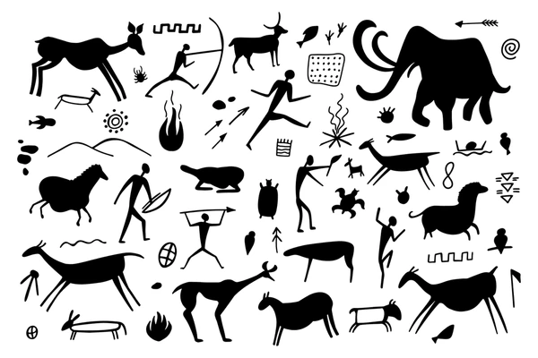{fig-align="center" width="90%"}
:::

::: {.column .fragment width="50%"}
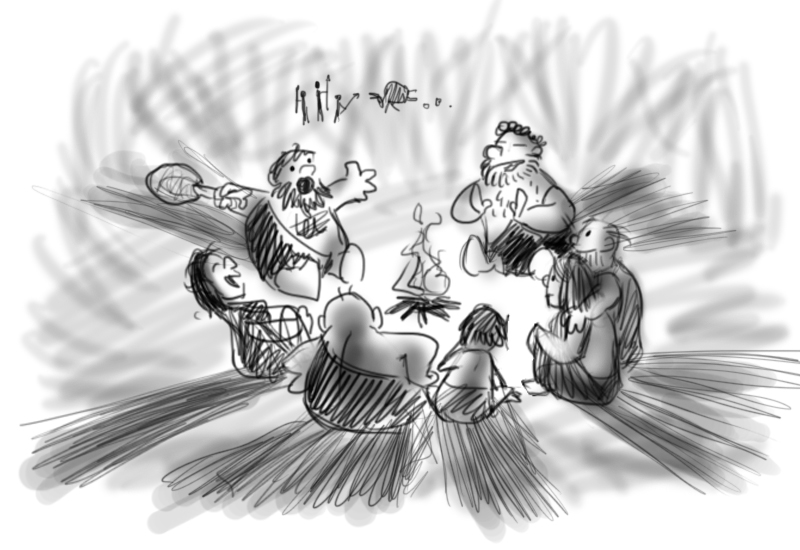{fig-align="center" width="100%"}
:::
:::

. . .

::: {style="text-align: center; "}
🔥 Las **historias** son la primera tecnología humana
:::

------------------------------------------------------------------------

## Esos cerebros tan hackables... {background-image="images/background.jpg" background-opacity="0.25"}

::: columns
::: {.column width="50%"}
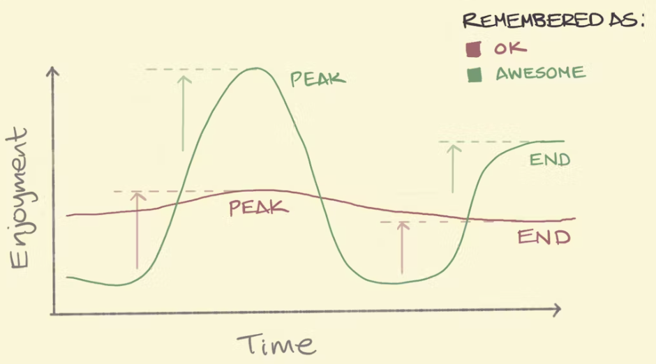{fig-align="center" width="90%"}\
*Regla del máximo y final (Peak-End Rule)*
:::

::: {.column .fragment width="50%"}
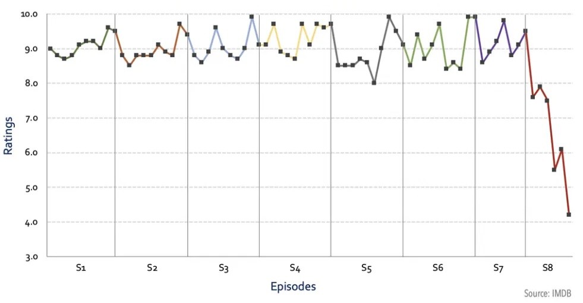{fig-align="center" width="100%"}\
*Rating de Game of Thrones, por Kelvin Neo*
:::
:::

------------------------------------------------------------------------

## Narrativa {background-image="images/background.jpg" background-opacity="0.25"}

::: columns
::: {.column width="60%"}
<br><br> Usar **trucos** de Storytelling (narrativa) para crear presentaciones que serán **recordadas** y que causarán **impacto**
:::

::: {.column .fragment width="40%"}
{fig-align="center"}
:::
:::

. . .

::: {style="text-align: center;"}
🎭 Las **emociones** generan acciones
:::

------------------------------------------------------------------------

## El mejor ejemplo {background-image="images/background.jpg" background-opacity="0.25"}

::: columns
::: {.column .fragment width="30%" fragment-index="1"}
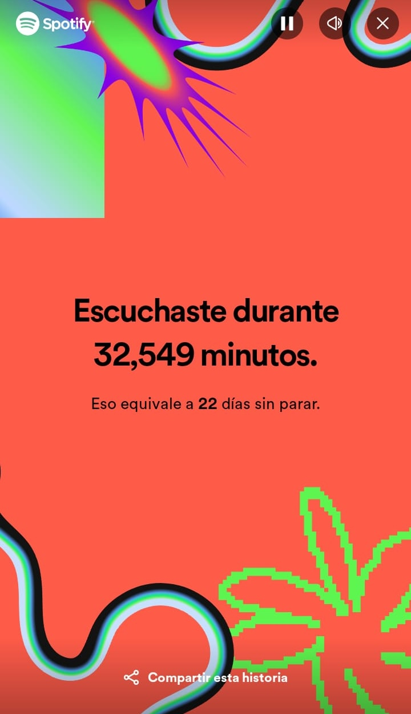{fig-align="center"}
:::

::: {.column .center width="40%"}
<br><br> ¿Podemos hacer que millones de personas compartan estadísticas en redes sociales?
:::

::: {.column .fragment width="30%" fragment-index="1"}
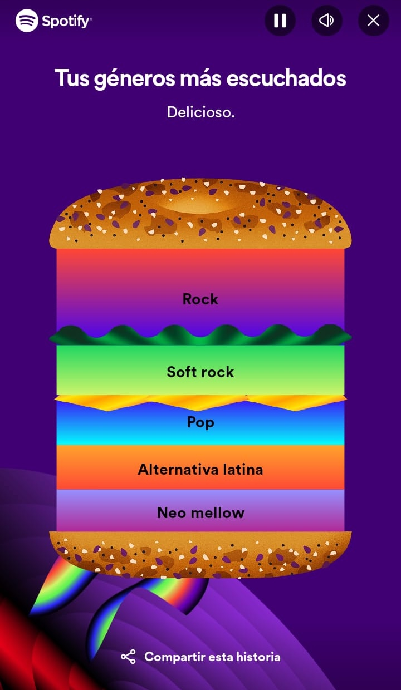{fig-align="center"}
:::
:::

------------------------------------------------------------------------

##  {background-image="images/background.jpg" background-opacity="0.25"}

::: {style="display: flex; justify-content: center; align-items: center; height: 60vh; flex-direction: column; text-align: center;"}
::: callout-note
## Regla de Storytelling #2

Los detalles son importantes, [pero no **todos** los detalles son importantes.]{.fragment}
:::
:::

------------------------------------------------------------------------

## Ejemplos {background-image="images/background.jpg" background-opacity="0.25"}

::: columns
::: {.column width="50%"}
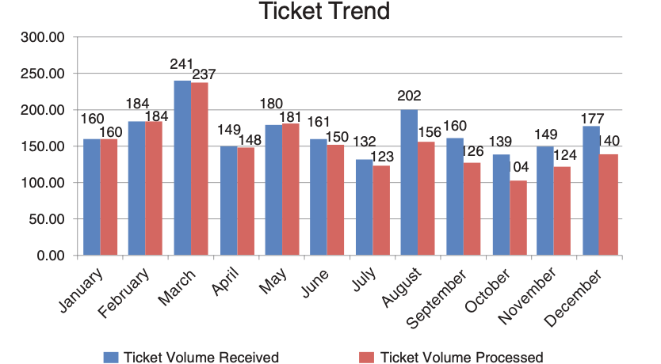{fig-align="center"} *🔢 No compartas números*
:::

::: {.column .fragment width="50%"}
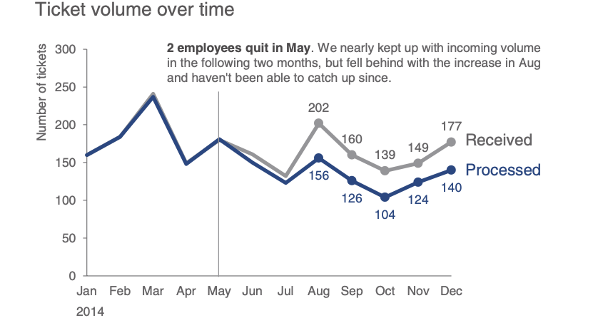{fig-align="center"} *🪶Comparte una historia*
:::
:::

. . .

<br><br> [(C) Storytelling with Data, por Cole Nussbaumer Knaflic.]{style="font-size: 0.75em; color: gray"}

------------------------------------------------------------------------

##  {background-image="images/background.jpg" background-opacity="0.25"}

::: {style="display: flex; justify-content: center; align-items: center; height: 60vh; flex-direction: column; text-align: center;"}
::: callout-note
## Regla de Storytelling #3

Tu primera versión **siempre** será horrible.
:::
:::

------------------------------------------------------------------------

## Ejemplos {background-image="images/background.jpg" background-opacity="0.25"}

::: columns
::: {.column width="50%"}
{fig-align="center"}
:::

::: {.column .fragment width="50%"}
{fig-align="center"}
:::
:::

. . .

::: {style="text-align: center;"}
🥱 1° versión $<$ ... $<$ 😊 última versión
:::

------------------------------------------------------------------------

## Usar chatbots de IA para: {background-image="images/background.jpg" background-opacity="0.25"}

::: columns
::: {.column width="65%"}
<br>

-   Plantillas personalizadas a medida
-   Automatizar estructura del contenido
-   Ahorro de tiempo en diseño
-   Adaptación al estilo y preferencias
:::

::: {.column .fragment width="35%"}
{fig-align="center"}
:::
:::

------------------------------------------------------------------------

## 💡 Chatbots A.I. - Ideas {background-image="images/background.jpg" background-opacity="0.25"}


::: columns
::: {.column width="60%"}
<br>

-   [ChatGPT (OpenAI)](https://openai.com/chatgpt/)
-   [Gemini (Google DeepMind)](https://deepmind.google/gemini/)
-   [Meta AI (Meta)](https://ai.meta.com/)
-   [DeepSeek (DeepSeek)](https://chat.deepseek.com/)
:::

::: {.column  width="40%"}

:::
:::


------------------------------------------------------------------------

## Usar chatbots de IA para: {background-image="images/background.jpg" background-opacity="0.25"}

::: columns
::: {.column width="60%"}
<br>

-   Analogías y ejemplos
-   Mejores traducciones
-   Prompts para crear imágenes
-   No busques imágenes, créalas!
:::

::: {.column .fragment width="40%"}
{fig-align="center"}
:::
:::

------------------------------------------------------------------------

## 💡 Chatbots A.I. - Imágenes {background-image="images/background.jpg" background-opacity="0.25"}


::: columns
::: {.column width="60%"}

<br>

- [Canva con Magic Studio](https://www.canva.com/magic/)
- [Microsoft Designer](https://designer.microsoft.com/)
- [Napkin AI](https://www.napkin.one/)
- [Artguru](https://www.artguru.ai/)
:::

::: {.column  width="40%"}

:::
:::


------------------------------------------------------------------------

##  {background-image="images/background.jpg" background-opacity="0.25"}

::: {style="display: flex; justify-content: center; align-items: center; height: 60vh; flex-direction: column; text-align: center;"}
::: callout-note
## Regla de Storytelling #4

[Explicar menos]{style="color: red"} y [mostrar más]{style="color: green"}
:::
:::

------------------------------------------------------------------------

## [Explicar menos]{style="color: red"} y [mostrar más]{style="color: green"} {background-image="images/background.jpg" background-opacity="0.25"}

::: columns
::: {.column width="50%"}
``` python
import matplotlib.pyplot as plt

# Datos de ejemplo
x = [1, 2, 3, 4, 5]
y = [2, 4, 3, 5, 7]

# Generamos el gráfico
plt.figure(figsize=(6, 4))
plt.plot(x, y, marker='o')
plt.title("Gráfico de Ejemplo")
plt.xlabel("Eje X")
plt.ylabel("Eje Y")
plt.grid(True)
plt.show()
```
:::

::: {.column .fragment width="50%"}
```{python}
import matplotlib.pyplot as plt

# Datos de ejemplo
x = [1, 2, 3, 4, 5]
y = [2, 4, 3, 5, 7]

# Generamos el gráfico
plt.figure(figsize=(6, 4))
plt.plot(x, y, marker='o')
plt.title("Gráfico de Ejemplo")
plt.xlabel("Eje X")
plt.ylabel("Eje Y")
plt.grid(True)
plt.show()
```
:::
:::

------------------------------------------------------------------------

## [Explicar menos]{style="color: red"} y [mostrar más]{style="color: green"} {background-image="images/background.jpg" background-opacity="0.25"}

```{pyodide-python}
import matplotlib.pyplot as plt
x = [1, 2, 3, 4, 5]
y = [2, 4, 3, 5, 7]
plt.figure(figsize=(5, 3))
plt.plot(x, y, marker='o')
plt.title("Gráfico de Ejemplo")
plt.grid(True)
plt.show()
```


------------------------------------------------------------------------

## Agenda (v2) {background-image="images/background.jpg" background-opacity="0.25"}

::: incremental
1.  Nunca reveles el [**final**]{.fragment style="color:grey;"}
2.  Los detalles son importantes, pero [no **todos** los detalles son importantes]{.fragment style="color:grey;"}
3.  Tu primera versión será [**horrible**]{.fragment style="color:grey;"}
4.  Muestra, no [**cuentes**]{.fragment style="color:grey;"}
:::

::: notes
Opción 2: Una agenda misteriosa.
:::

------------------------------------------------------------------------

##  {background-image="images/background_slides3.png" background-opacity="0.3"}

::: {style="display: flex; justify-content: center; align-items: center; height: 60vh; flex-direction: column; text-align: center;"}
[Visualización]{style="font-size: 1em"}

[¿Qué es la Visualización?]{style="font-size: 2em"}
:::

------------------------------------------------------------------------

## Visualización... {background-image="images/background.jpg" background-opacity="0.25"}

::: columns
::: {.column width="60%"}
<br>

-   Convierte datos en gráficos para facilitar su comprensión.
-   Destaca patrones y tendencias de forma clara.
:::

::: {.column .fragment width="40%"}
{fig-align="center"}
:::
:::

------------------------------------------------------------------------

## Ejemplos {background-image="images/background.jpg" background-opacity="0.25"}

::: columns
::: {.column width="50%" style="text-align: center;"}
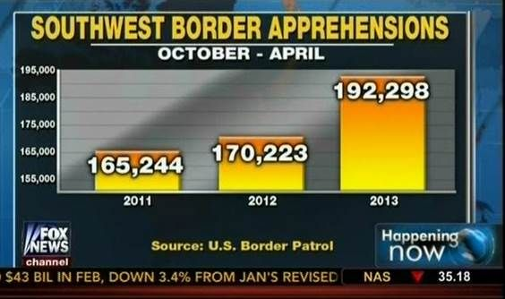{fig-align="center" width="100%"}

*❌ Mal Gráfico*
:::

::: {.column .fragment width="50%" style="text-align: center;"}
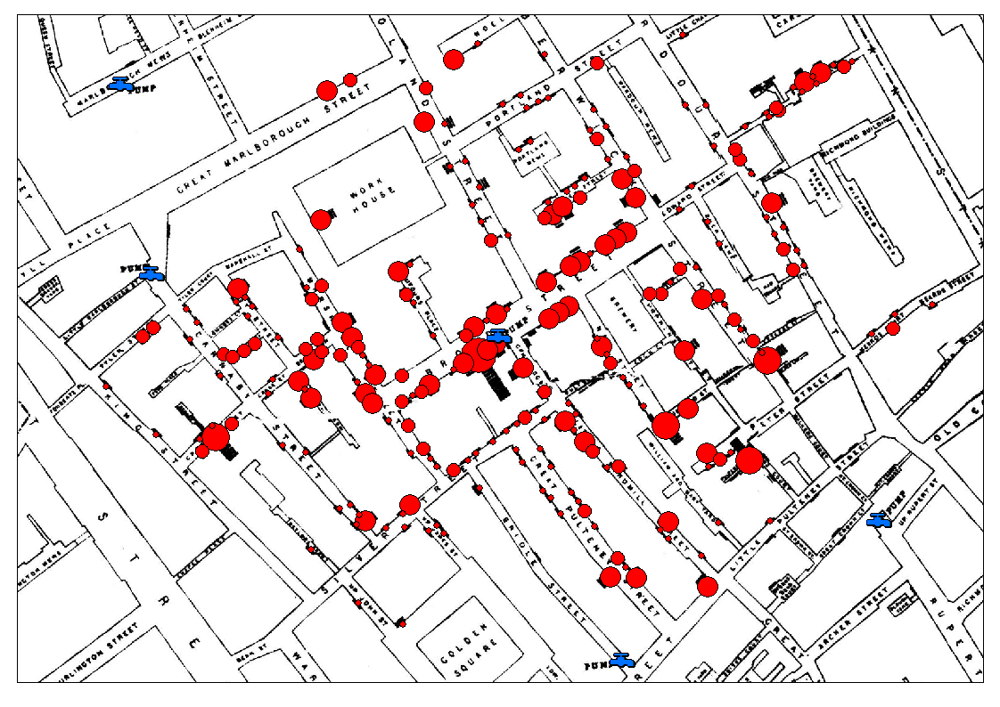{fig-align="center" width="80%"}

*✅ Buen Gráfico*
:::
:::

## Cuarteto de ANSCOMBE {background-image="images/background.jpg" background-opacity="0.25"}

::: columns
::: {.column width="50%" style="text-align: center;"}
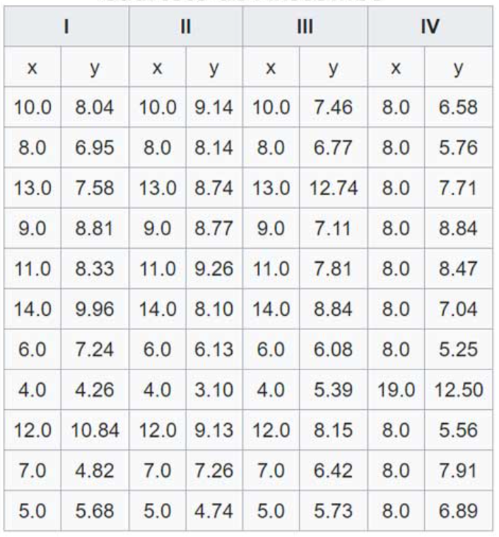{fig-align="center" width="80%"}
:::

::: {.column .fragment width="50%" style="text-align: center;"}
<br> {fig-align="center" width="100%"}
:::
:::

::: {.fragment style="text-align:center"}
📋 Tablas vs 📊 Gráficos
:::

------------------------------------------------------------------------

### Datasaurus {background-image="images/background.jpg" background-size="cover" background-opacity="0.5"}

{width="80%"}

------------------------------------------------------------------------

## Teoría de Visualización {background-image="images/background.jpg" background-opacity="0.25"}

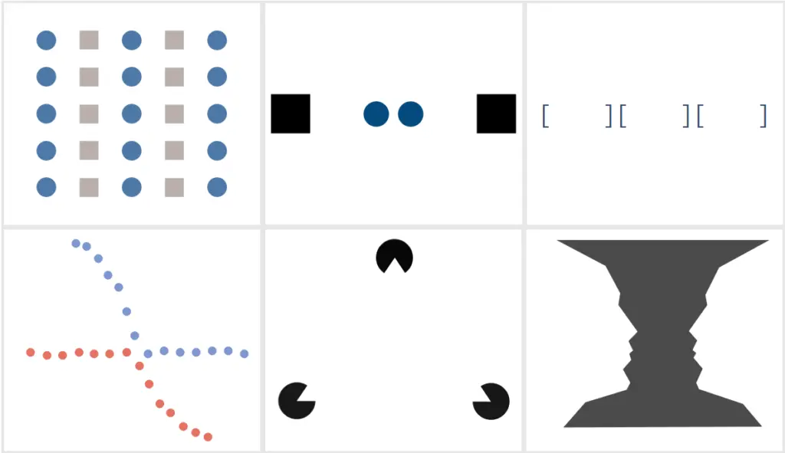{fig-align="center" width="50%"}

------------------------------------------------------------------------

## 4 Pilares Visualización - Noah Iliinsky {background-image="images/background.jpg" background-opacity="0.25"}

::: columns
::: {.column .fragment width="60%"}
<br>

1.  **Propósito**: Define la meta.
2.  **Contenido**: Datos relevantes.
3.  **Estructura**: Organización clara.
4.  **Formato**: Gráfico adecuado.
:::

::: {.column width="40%"}
{fig-align="center"}
:::
:::

. . .

[(C) Noah Iliinsky: "Four Pillars of Visualization" - Youtube.]{style="font-size: 0.75em; color: gray"}

------------------------------------------------------------------------

## Qué Gráficos son buenos? {background-image="images/background.jpg" background-opacity="0.25"}

::: {style="display: grid; grid-template-columns: repeat(3, 1fr); gap: 10px;"}
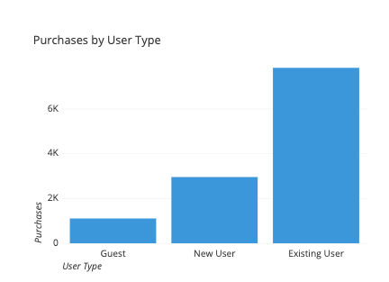 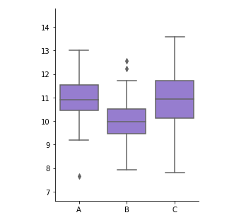

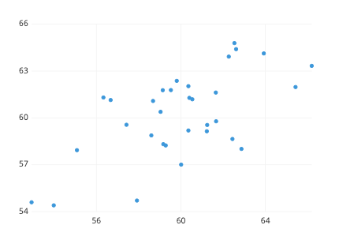 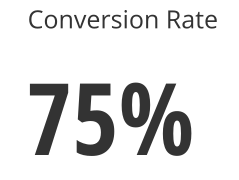

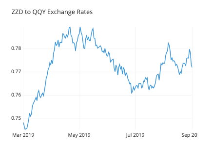 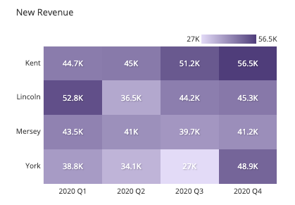
:::

. . .

[(C) Essential chart types for data visualization, por Atlassian.]{style="font-size: 0.75em; color: gray"}

------------------------------------------------------------------------

##  {background-image="images/background_slides3.png" background-opacity="0.3"}

::: {style="display: flex; justify-content: center; align-items: center; height: 60vh; flex-direction: column; text-align: center;"}
[Herramientas]{style="font-size: 1em"}

[Herramientas de Visualización]{style="font-size: 2em"}
:::

## Herramientas para presentación {background-image="images/background.jpg" background-opacity="0.25"}

::: columns
::: {.column width="60%"}
-   **Clásica**: PowerPoint
-   **"Show don't tell"**:
    -   Quarto
    -   Streamlit
-   **Otros**: Canvas, Revealjs, Prezi
:::

::: {.column width="40%"}
{fig-align="center"}
:::
:::

------------------------------------------------------------------------

## Quarto {background-image="images/background.jpg" background-opacity="0.25"}

::: columns
::: {.column width="60%"}
<br>

Un sistema abierto para publicaciones científicas con markdown y código interactivo (Python/R).
:::

::: {.column width="40%"}
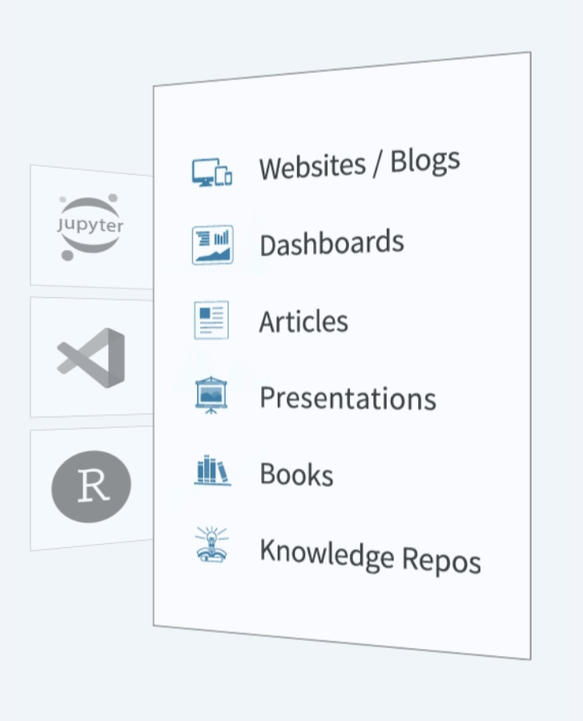
:::
:::

------------------------------------------------------------------------

##  {background-image="images/background.jpg" background-opacity="0.25"}

::: columns
::: {.column width="40%"}
[Código: example.qmd]{style="font-size: 0.5em; color: gray"}

```         
---
title: "Habits"
author: "John Doe"
format:
  revealjs:
    transition: fade
    theme: black
    toc: true
    center: true
---

## Getting up

- Turn off alarm
- Get out of bed

---

## Going to sleep 
::: { .incremental }

- Get in bed
- Count sheep

:::
```
:::

::: {.column width="60%"}
[Slides: example.html]{style="font-size: 0.5em; color: gray"}

```{=html}
<iframe width=600 height=400 src="images/quarto/quarto_min.html"></iframe>
```
:::
:::

------------------------------------------------------------------------

## Streamlit {background-image="images/background.jpg" background-opacity="0.25"}

::: columns
::: {.column width="60%"}
<br><br> Es una herramienta de código abierto que facilita la creación de aplicaciones web interactivas utilizando únicamente Python.
:::

::: {.column width="40%"}
<br> 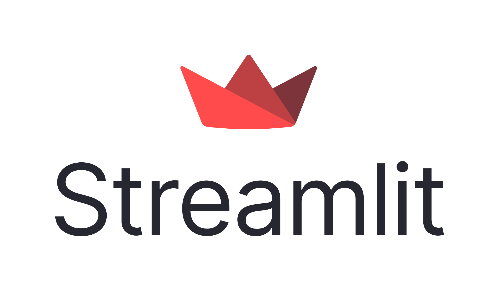
:::
:::

------------------------------------------------------------------------

### Streamlit: Ejemplo


------------------------------------------------------------------------

## Streamlit: Ejemplo {background-image="images/background.jpg" background-opacity="0.25"}

::: columns
::: {.column width="50%"}
``` python
import streamlit as st

# Título principal de la aplicación
st.title("Hola Streamlit")

# Mensaje principal con nombres y emoticón fijos
mensaje = "Darwin y Patricia son mejores amigos 😊"
st.write(mensaje)

# Imagen decorativa
st.image(
    "https://www.svgrepo.com/show/397758/people-hugging.svg",
    caption="Amigos",
    width=200  # Ajuste del tamaño de la imagen
)

# Footer
st.markdown(
    """
    ---
    Gracias por usar esta aplicación interactiva 🎈
    """
)
```
:::

::: {.column .fragment width="50%"}
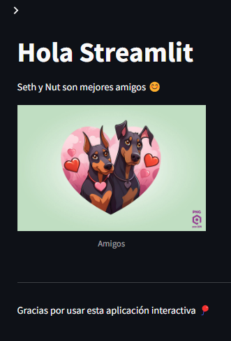{fig-align="center" width="65%"}
:::
:::

. . .

::: {style="text-align: center; margin-top: -30px;"}
[(C) Ejemplo en Streamlit - Playground.]([gCISH6_BP-AiBTGq3jOCQWRz5YA1q9YorW8rM2GLi6RCGsCuQzuNYGVfGjnhcL4BDsQ_iPvpKGd6sQQ3-ixok1FOMXkmFjGsUs2_XgIE0yTix5x0xSmk6BUJptgdkmudivfx4lfh-ffr8--e7lK2XH7408c2yie9_iBe1F4_-sYxNqa_ZZRs7h3AqLlsDFmxpmw8WwFaxQ3Pr2UwsVG4DXG60L0S6ruaaWqZ6x-PcU87mlqxdFZhTeh3SeozqDBOkLnYy4E_MYnThbr9fVVUvnDHS2Z60RT_MbNW_eefo6NbtviPrNHVnZZ4rk6dlYr9GS3SRLRqK41paWy0DjaXVZWHGlZrG2fAEdaCm1xQGBwcALHRehkgsTkPEAlffbDsCjeqsPs2JtZF8kl2gfzm1lWmVC1HHbrdbxwfpffNw8bixgvS2Qrw2TKAME6FMLsB6-fb1X5q97A_oi2bFpgMAAA](https://streamlit.io/playground?example=geospatial&code=H4sIAAAAAAAAA4WTvW4TQRDH-3uK0dI4Us7OOVESkFxESIGGUIQOIWu9Ht-ts1_s7tn5UHqEEB8dDXJDhygQEqLPm_AC5BGYvTuTRBRcs3szN7_9z39vpHbWRwjRI9dKRuCBXrLsHjy7-hprZcF5aYR0XMEUQXHgTknBhbz6brIQ-1FGhT322FLqeE1hG4lwLKc44R6ENVQbhJeuKYMzsLSzBkNiUnomy9rfMENbuGY_7T4m6q3k0stIyYfrakAFGk3gc7yl-SyFUdsoBcH7rbA1ENCkdEcEx4ni0AdruJLnFLlBZsbqiccCRnBbIJ7GsTSujj121HwABdsEdoyxoqPamuF_a4ap5qhOtrVSybA7NQEVijixpz1C0zbJ51Cbm86I8Jxdrz6-Tqhfnz7__vku7a5XH76065tVu77_wV40Jjz5xytyo7lfl619HMGMXXSdX5KX3X54CeQRWTO3nlzkWpY2wMVa-yVL99TeT0dqTjwoPZbkak3apeYlpt9CWM-jXPBU0gR7GdDDqhhdeDAYaJxKXvRjhVVtSn82d1j2hdWDWNV6EoYD6-V4Z7sY7uzujE1Z3C8Xe0a83Lcl3-PLk1mx3BuWYTE5N-f-ROzvFlHq0_GCKzRRGsyFrZ3C3M7yqZ2g19zkTpogKvT9uSvZZiNHcBfJ8xE7aHrtonXAMfUbOYH8eCmnsYLRIVcB23wTGW1vbQFQ9_M6RKSOFUSu-dU32w1Ua0XWWHRobUSfvNDcn0zt0nR2MNaseZ4366M0LTSqNLykIv2pId4ZTZCGQFwka-F69fbVX8xG9gcSs8059AMAAA)){style="font-size: 0.75em; color: gray"}
:::

------------------------------------------------------------------------


## HTML & webapps {background-image="images/background.jpg" background-opacity="0.25"}

::: columns
::: {.column .fragment width="50%"}
🛠️ Elige una herramienta
:::

::: {.column .fragment width="50%"}
💡 La innovación destaca
:::
:::

{fig-align="center"}

------------------------------------------------------------------------

## Flujo de decisión {background-image="images/background.jpg" background-opacity="0.25"}

<br>

::: incremental
-   🎤 **PowerPoint**: Presentación sin código de un solo uso
-   📚 **Quarto**: Charlas a partir de documentos relacionados
-   💻 **Streamlit**: Presentaciones interactivas (Python)
-   🎨 **Más**: Canvas, Revealjs, Prezi
:::

------------------------------------------------------------------------

## 📌 Actividad {background-image="images/background.jpg" background-opacity="0.25"}

<br>

1.  📂 **Clonar el Google Drive**:
    -   Accede al siguiente enlace y copia la carpeta en tu propio Google Drive:
        -   [Google Drive - Actividad](https://drive.google.com/drive/folders/1DMiJvTLyvfglsSflqxl-vjqu8skScQSQ)
2.  📝 **Resolver la actividad**:
    -   Abre el archivo [actividad_04.pptx](https://drive.google.com/drive/folders/1IBxxHsJUXHQ4b5hln7MxEFRCXQqzaNI1?usp=drive_link) dentro de la carpeta clonada.\
    -   Sigue las instrucciones dentro de la PPT y completa los ejercicios.

------------------------------------------------------------------------

##  {background-image="images/background_slides3.png" background-opacity="0.3"}

::: {style="display: flex; justify-content: center; align-items: center; height: 60vh; flex-direction: column; text-align: center;"}
[Sesión 02]{style="font-size: 1em"}

[Conclusiones]{style="font-size: 1.5em"}
:::

------------------------------------------------------------------------

## Conclusión {background-image="images/background.jpg" background-opacity="0.25"}

<br>

::: incremental
-   **📖 Storytelling**: Narrativas que cautivan a través de datos.\
-   **📊 Visualización**: Gráficos claros y atractivos.\
-   **🛠️ Herramientas**: Streamlit, Quarto, y más.
:::

------------------------------------------------------------------------

## 🎉 ¡Gracias por Participar! {background-image="images/background.jpg" background-opacity="0.25"}

::: columns
::: {.column width="50%"}
<br>

❓¿Preguntas?

👏 Responder [encuesta](https://docs.google.com/forms/d/e/1FAIpQLSeDUAAqdtHILOMg2fn-wTOcaLtgrgLsEPp0Xg_erSNJLZPvzg/viewform?usp=dialog)

🥳 Gracias de Nuevo
:::

::: {.column width="50%" align="center"}
{width="400"}
:::
:::

> 🔗 Nuestro Sitio Web: [seth-nut.github.io/resources](https://seth-nut.github.io/resources/).

```{=html}
<style>
/* Ajusta el tamaño del título y subtítulo */
.reveal .slides h1 {
  font-size: 2em; /* Tamaño más pequeño para el título */
}

.reveal .slides h2 {
  font-size: 1.5em; /* Tamaño más pequeño para el subtítulo */
}

/* Ajusta el tamaño de los bullets */
.reveal .slides ul {
  font-size: 0.8em; /* Tamaño de fuente más pequeño en los bullets */
}

</style>
```