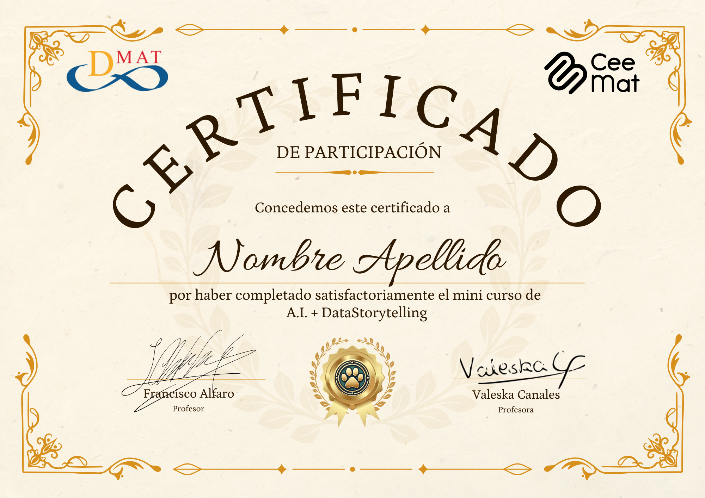

## Información General

-   **Nombre completo:** Francisco Alfaro & Valeska Canales\
-   **Área de especialización:** Estadística, Machine Learning, Inteligencia Artificial\
-   **Cantidad de sesiones a realizar:** 4 sesiones de 1 hora

## Breve Descripción

Este mini curso está diseñado para introducir a los estudiantes en el uso de herramientas digitales y técnicas de inteligencia artificial para la comunicación efectiva en un entorno académico y profesional. A través de 4 sesiones prácticas y dinámicas, aprenderán a utilizar herramientas esenciales, desarrollar prompts efectivos para ChatGPT, mejorar sus habilidades de comunicación en el ámbito universitario y explorar los fundamentos del Data Storytelling para transmitir ideas complejas de manera clara y visual.

::: {.callout-note collapse="true"}
## ⚖️ **Consideraciones Éticas sobre el Uso de A.I.**

El uso de herramientas de inteligencia artificial en este curso tiene como principal objetivo **apoyar a los estudiantes en su aprendizaje**, facilitando el desarrollo de habilidades y competencias en un entorno digital y tecnológico. Este curso está diseñado de manera ética y responsable, **sin transgredir ninguna política institucional**.

No obstante, es importante considerar que cada institución, departamento o profesor puede tener sus propias políticas definidas respecto al uso o prohibición de herramientas de inteligencia artificial. Por ello, se **recomienda a los estudiantes informarse y respetar dichas directrices**, en caso de que existan.

Este curso está alineado con buenas prácticas éticas y no busca contradecir ninguna política establecida. Si tienes dudas sobre el uso de estas herramientas en tu contexto académico, **consulta con tu profesor o institución**.
:::

## Prerrequisitos

No se requieren conocimientos previos en programación o herramientas avanzadas. Solo se necesita entusiasmo por aprender y explorar nuevas formas de trabajar con datos y tecnología.

## Sesiones

-   🎤 [**Toolkit Básico de Google**](toolkit_google/presentacion.html) - Aprende a utilizar herramientas esenciales de Google (Docs, Sheets, Slides, Colab y Drive) para optimizar la colaboración y la productividad académica. Descubre trucos y funcionalidades avanzadas para mejorar tu trabajo diario.

-   🎤 [**Prompts Perfectos en ChatGPT**](prompts_chatgpt/presentacion.html) - Diseña preguntas y comandos efectivos para interactuar con herramientas de inteligencia artificial como ChatGPT. Aprende a estructurar prompts que resuelvan problemas académicos, generen ideas y mejoren tus resultados de manera precisa y ética.

-   🎤 [**Leer, Escribir y Hablar en la Universidad**](comunicacion_universidad/presentacion.html) - Mejora tus habilidades de comunicación académica con técnicas para leer críticamente, redactar ensayos efectivos y organizar presentaciones orales de impacto. Descubre cómo la inteligencia artificial puede apoyarte en cada paso del proceso.

-   🎤 [**A.I + Data Storytelling**](datastorytelling/presentacion.html) - Esta presentación te enseñará a transformar datos en historias visuales interactivas usando A.I y otras herramientas. Descubre cómo crear presentaciones dinámicas e impactantes que cautiven a tu audiencia.

## Certificación

Al finalizar el curso, se otorgará un diploma como este:

::: {style="text-align: center;"}

:::

> 📌 **Recuerda**:  
> 
> * La **asistencia** al curso es obligatoria, salvo inasistencias **justificadas** y conversadas previamente con los docentes.  
> * Todas las **encuestas** son obligatorias, ya que nos permiten hacer seguimiento de tu avance y mejorar futuras ediciones del curso.  
> * Para obtener la **certificación**, debes completar **todas las actividades** del programa.

###  Diplomas

- [CEEMAT 2025 - 1° Semestre](diplomas/diplomas1.html)